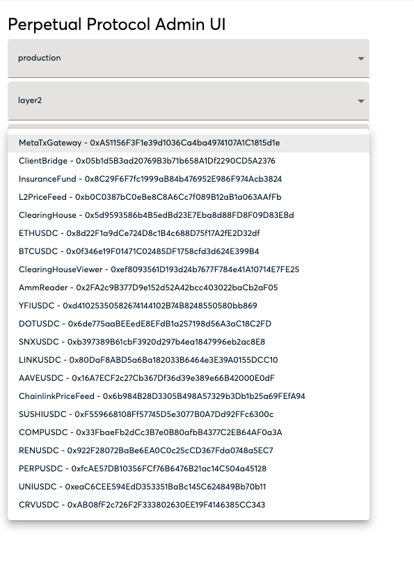

# perp admin safe app

Perp admin app is a project for executing openzeppelin upgradable contract of Perpetual protocol. Sending transaction on an upgradable contract with the gnosis safe app is pretty painful. You need to copy abi from blockscout or etherescan and fill proxy address in "to" field, which is pretty easy to fill wrong addresses such as implementation address.

perp admin safe app is forked from [gnosis/safe-react-apps](https://github.com/gnosis/safe-react-apps) and add contract select input and automatic fill abi to avoid mistake.

## Usage

1. open a gnosis safe app
2. click apps on sidebar
3. click add custom app
4. fill `https://admin.perp.exchange/` to App URL
5. select production or staging environment, layers and contract
6. sending transactions!

## License

This library is released under MIT.

